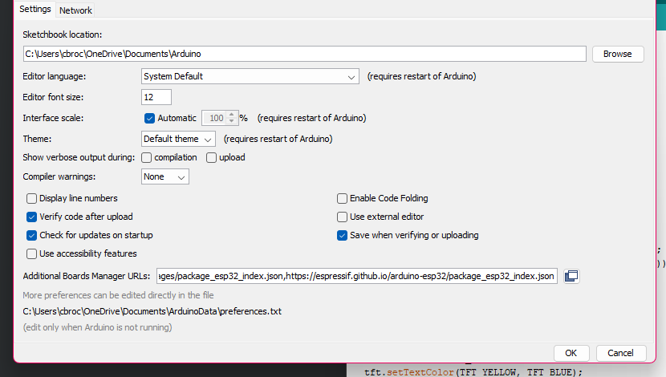

Original conversation
https://chatgpt.com/share/695350ac-3a44-8009-996a-2be9a1ac8ce5

---
The above chat includes the part where we downloaded / referenced a repo

Arduino IDE → File → Preferences

In Additional Boards Manager URLs, paste this:
https://raw.githubusercontent.com/espressif/arduino-esp32/gh-pages/package_esp32_index.json

## TFT_eSPI Library Configuration

This project uses the TFT_eSPI library from: https://github.com/Bodmer/TFT_eSPI

### Modified Files Included in This Repo

The following files from TFT_eSPI-master have been copied to this repo:
- `tft_setup.h` - Our custom display configuration (ILI9341 driver)
- `User_Setup.h` - Library setup template (reference)
- `User_Setup_Select.h` - Setup selector (modified to use Setup_ESP32_3248S035.h)
- `User_Setups/Setup_ESP32_3248S035.h` - ESP32-3248S035 display configuration

### How It Works

The sketch uses `tft_setup.h` (via `__has_include` in TFT_eSPI.h) which overrides the library's default configuration. This allows per-sketch configuration without modifying the library itself.

